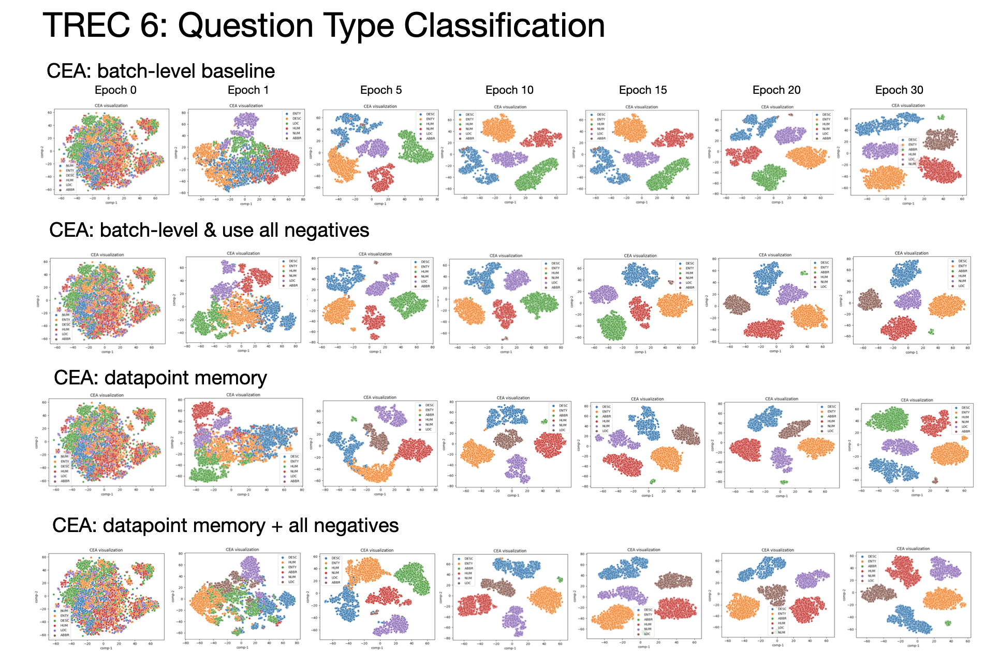
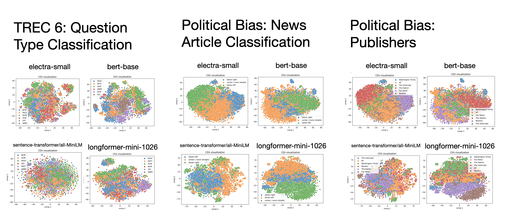
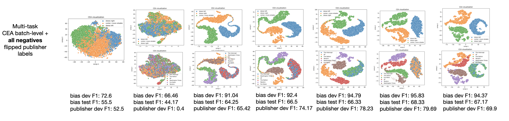

# CAE - Class-driven Embedding Alignment

Class-driven Embedding Alignment Model (CEA). Learn embeddings that maximize the similarity between two textual documents if they share the same class label 👉👈, and minimize if they don't 👈👉.

```
git clone https://github.com/flairNLP/flair.git
cd flair

# switch to cea branch <- the latest model is still in this repo
git checkout embedding-alignment

python3 -m venv flair-env
pip install -r requirements.txt
```

# Training on TREC dataset

```python3
from flair.datasets import TREC_6
from flair.embeddings import TransformerDocumentEmbeddings
from alignment_model import CEA
from flair.trainers import ModelTrainer

# specify gpu device
import flair, torch
flair.device = torch.device('cuda:0')

# load dataset
corpus = TREC_6()

# specify label type
label_type = 'question_class'  # just 'class' for TREC_50

# create the label dictionary
label_dict = corpus.make_label_dictionary(label_type=label_type)

print(corpus)

# initialize transformer document embeddings
document_embeddings = TransformerDocumentEmbeddings('google/electra-small-discriminator', fine_tune=True)

# create embedding alignment model
classifier = CEA(document_embeddings,
                 train_corpus=corpus.train,
                 label_type=label_type,
                 label_dictionary=label_dict,
                 knn=5,  # k for knn predictions
                 )

# initialize trainer
trainer = ModelTrainer(classifier, corpus)

# run training with fine-tuning
trainer.fine_tune('resources/taggers/small-transformer-alignment',
                  learning_rate=5e-5,
                  mini_batch_size=32,
                  max_epochs=10,
                  )
```

# Excurse: evaluating frozen models + KNN on different text classifaction datasets

- Table 1. uses frozen CLS token and performs KNN (n=5) on the complete dataset (train+dev+test)

| Model             | TREC6     | TREC50    | Communicative functions | SST Binary | SST Granular (5 class) | Go Emotions |
|-------------------|-----------|-----------|-------------------------|------------|------------------------|-------------|
| all-MiniLM-L12-v2 | 65.66     | 53.01     | 61.62                   | 92.61      | 55.16                  | 47.15       |
| electra-small     | 76.06     | 64.33     | 65.53                   | 84.66      | 52.22                  | 44.34       |
| electra-base      | 80.48     | 69.07     | 68.46                   | 85.68      | 56.17                  | 43.83       |
| bert-base-cased   | __87.28__ | __78.49__ | __76.95__               | __92.43__  | 56.07                  | __50.53__   |
| roberta-base      | 84.88     | 74.26     | 69.82                   | 91.41      | __58.18__              | 47.29       |
| concat all models | 85.99     | 75.54     | 72.36                   |            | 57.68                  |             |

- Table 2. uses frozen DocumentPoolEmbeddings (average all tokens) and performs KNN (n=5) on the complete dataset (train+dev+test)

| Model             | TREC6     | TREC50    | Communicative functions | SST Binary | SST Granular (5 class) | Go Emotions |
|-------------------|-----------|-----------|-------------------------|------------|------------------------|-------------|
| all-MiniLM-L12-v2 | 81.97     | 73.2      | 66.89                   | 92.68      | 57.71                  | 46.9        |
| electra-small     | 82.66     | 71.52     | 71.88                   | 88.99      | 54.04                  | 45.12       |
| electra-base      | 83.87     | 72.88     | 70.31                   | 89.61      | 55.98                  | 46.01       |
| bert-base-cased   | __87.26__ | __79.39__ | __76.76__               | __92.8__   | 58.05                  | __49.02__   |
| roberta-base      | 85.52     | 77.17     | 73.83                   | 92.04      | __58.49__              | 48.6        |


- Question: can we tell which model (encoder) is most best suited for a task by looking how well frozen model + KNN is able to classify the data (initial knowledge in LM)? 
- How I see it so far: It's a good indicator but it's not precise. Fine-tuning a similar model (even when it's weaker initially) can outperform others. E.g. electra scores slightly better than others when fine-tuned.   

# Results

- parameters: learning rate 5e-5, batch size 32, epochs 10

| model           | details                | Trec 6   | Trec 50   |
|-----------------|------------------------|----------|-----------|
| electra-small   | fine-tuning            | 96.2     | 89.8      |
| electra-small   | CEA (batch-level)      | 96.2     | 83.0      |
| electra-small   | CEA + memory           | 96.0     | 81.4      |
| electra-small   | CEA + mixed memory     | 96.4     | 84.5      |
| electra-small   | CEA + datapoint memory | 96.4     | 85.0      |
| --------------- | -------------------    | -------- | --------- |
| bert-base       | fine-tuning            | 97.4     | 92.6      |
| bert-base       | CEA (batch-level)      | 97.2     | 90.6      |
| bert-base       | CEA + memory           | 96.4     | 90.6      |
| bert-base       | CEA + mixed memory     | 97.2     | 90.8      |
| bert-base       | CEA + datapoint memory | 97.4     | 92.4      |

Takeaway:
- CEA can barely recreate scores of fine-tuning (i.e. cea scores slightly lower or the same as fine-tuning).
- Hard with a lot of classes (TREC_50); this can be due to my implementation where sampling for sentence pairs is done inside a batch.
- __CEA + datapoint memory gives best results 👈__

## Follow-up on using all negatives

Takeaway:
- doing more comparisons (creating as many pairs as possible) works better
- batch + all comparisons is OK
- datapoint memory + all comparisons needs a lot of gpu memory

| model         | details                     | Trec 50 | Comment                                                                                                                   |
|---------------|-----------------------------|---------|---------------------------------------------------------------------------------------------------------------------------| 
| electra-small | fine-tuning                 | 89.8    |                                                                                                                           |
| electra-small | CEA (batch)                 | 82.8    |                                                                                                                           |
| electra-small | CEA (batch) + all negatives | 86.0    | 👈 this works ok. embedd a full batch and comapre distances between all pairs. needs 15 epochs (slightly longer to train) |
| electra-small | CEA memory                  | 85.0    |                                                                                                                           |
| electra-small | CEA memory + all negatives  | 88.2    | hard to fit in memory                                                                                                     |

## Visualizing CEA approaches




# Political Bias Dataset

- Transformers to consider:
  - electra-small (just because of the speed and gpu memory)
  - bert-base (classic)
  - longformer (probably the best choice for long documents). Longformer has a [smaller version (1096 tokens)](kiddothe2b/longformer-mini-1024) and [medium (4096 tokens)](allenai/longformer-base-4096) 👈 This one would be to go, just barely fits anywhere (setup: gruenau9 + batch size 4 or 8)

## About the dataset

- Labels: skews right, skews left, center / more reliable
- Corpus: 8640 train + 960 dev + 1200 test sentences
- train set size: 8640 (2880 instances for each class)
- dev set size: 960 (320 for each class)
- test set size: 1200 (400 for each class)
- Publishers in train and dev sets: Fox News, The Nation, AP, Washington Times, The Intercept, Reuters
- Publishers in test set: The Washington, Free Beacon, The New Yorker, CNBC

## Evaluating frozen models on political bias



| model                      | train F1 | dev F1    | test F1   |
|----------------------------|----------|-----------|-----------|
| all-MiniLM-L12-v2          | 88.07    | 69.17     | 52.42     |
| electra-small              | 86.88    | 72.6      | 55.83     |
| bert-base-cased            | 88.04    | 74.58     | 57.33     |
| bert-base-uncased          | 89.64    | 76.04     | 58.42     |
| longformer-mini-1024       | 90.2     | 76.46     | 51.08     |
| longformer-base-4096       | 96.68    | __88.02__ | 59.33     |
| bigbird-roberta-base-4096  | 93.96    | 85.1      | 63.83     |
| bigbird-roberta-large-4096 | 93.32    | 79.48     | __67.67__ |

Takeaway:
- Transformers for longer sequences score ok even when frozen
- Big generalization gap between test set and train set (generalization gap ~30.0) even with frozen model+KNN

## Fine-tuning models on political bias

| model           | details              | dev F1  | test F1 |
|-----------------|----------------------|---------|---------|
| electra-small   | fine-tuning 2e-5, 32 | 97.5    | 67.6    |
| bert-base-cased | fine-tuning 2e-5, 32 | 97.81   | 66.4    |
| longformer-base | fine-tuning 2e-5, 4  | 98.02   | 72.0    |

## CEA on political bias

| model           | details                      | dev F1    | test F1    |
|-----------------|------------------------------|-----------|------------|
| electra-small   | fine-tuning                  | 98.2      | 67.6       |
| electra-small   | CEA (batch)                  | 98.1      | 66.8       |
| electra-small   | CEA (batch) + all negatives  | 98.0      | 67.2       |
| electra-small   | CEA (memory)                 | 97.5      | 67.9       |
| electra-small   | CEA (memory) + all negatives | -         | -          |
| --------------- | --------------------         | --------  | ---------  |
| longformer-base | fine-tuning                  | 98.02     | 72.0       |
| longformer-base | CEA + multitask              | -         | -          |


## Multitask + flipped labels



- Current focus: create a strong objective for pushing same publishers apart
- So far it has not been successful (train f1 for publishers still scores around 50.0)